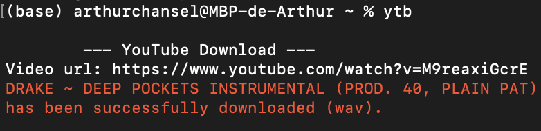

# ytb

## Launch the program
Launch the program with python by typing "python ytb.py" in the program directory from the Terminal command line.

I personnaly use a shortcut with the short keyword "ytb" that launches the code from the right directory.

## How does it work ?
As you launch the program, you'll see the following interface in the Terminal command line. Enter the url of the desired video after "Video url:" then hit enter, and a red message will confirm that you successfully downloaded the wav file ! Go check your directory and you should immediately see the file.

  

## Libraries
This program uses pytube package.

## License
[MIT License](LICENSE)
